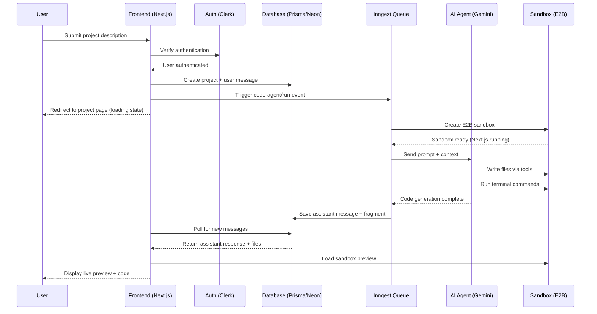
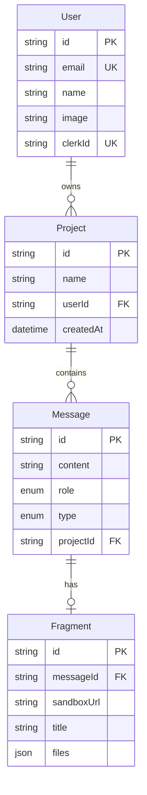
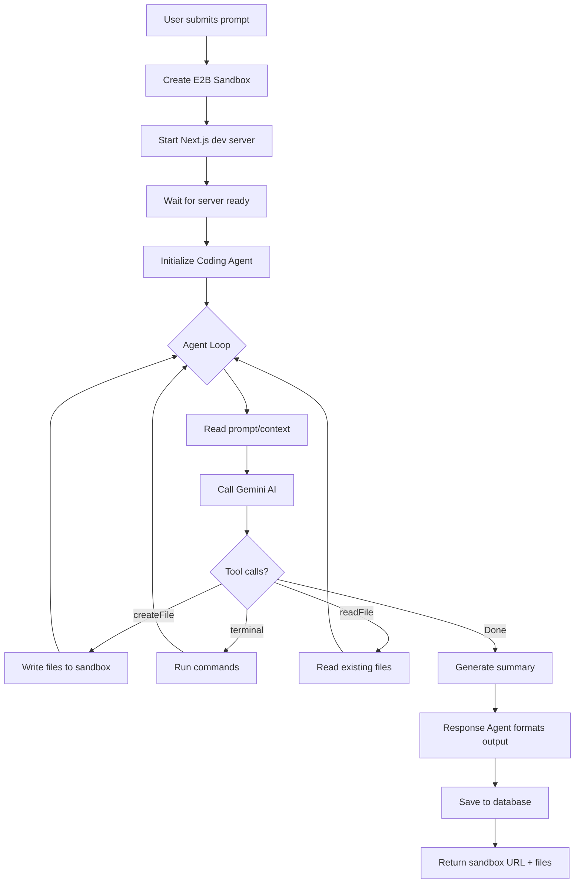

# v0-Clone - AI-Powered Code Generation Platform

A full-stack AI code generation platform inspired by Vercel's v0. Built with Next.js 16, this platform lets you describe any UI or web application idea in plain English and watch as AI generates working, deployable code in real-time.


## What It Does

You type something like "Build me a landing page for a coffee shop with a hero section, menu grid, and contact form" and the AI generates complete, working React code. The generated app runs live in a cloud sandbox so you can preview it immediately, tweak the styling, or download the code.

---

## Tech Stack

| Layer | Technology |
|-------|------------|
| Frontend | Next.js 16, React 18, Tailwind CSS 4 |
| Authentication | Clerk |
| Database | PostgreSQL (Neon) + Prisma ORM |
| AI Agent | Inngest + Gemini 2.5 Flash |
| Code Sandbox | E2B (cloud execution) |
| Code Highlighting | Shiki + Monaco Editor |
| UI Components | Radix UI + shadcn/ui |

---

## How It Works

### High-Level Flow

```
User Input → Create Project → Trigger AI Agent → Generate Code → Run in Sandbox → Display Preview
```

### Detailed Architecture



---

## Project Structure

```
vo/
├── app/                    # Next.js app router
│   ├── (auth)/            # Auth pages (sign-in, sign-up)
│   ├── (root)/            # Main dashboard
│   └── project/[id]/      # Individual project view
│
├── modules/               # Feature modules
│   ├── auth/             # Authentication logic
│   ├── home/             # Dashboard components
│   ├── projects/         # Project management
│   ├── messages/         # Chat interface
│   └── fragment/         # Code preview & editor
│
├── inngest/              # Background job processing
│   ├── client.js         # Inngest client setup
│   └── functions.js      # AI agent workflow
│
├── prisma/
│   └── schema.prisma     # Database models
│
├── components/           # Shared UI components
└── lib/                  # Utilities
```

---

## Database Schema



---

## The AI Agent Pipeline

The core magic happens in the Inngest function. Here's how a single request flows:

### Workflow Diagram



### Agent Tools

The AI has three tools at its disposal:

| Tool | Purpose |
|------|---------|
| `createFile` | Write or update files in the sandbox |
| `terminal` | Execute shell commands (npm install, etc.) |
| `readFile` | Read existing file contents |

---

## Getting Started

### Prerequisites

- Node.js 18+
- PostgreSQL database (I use Neon)
- Clerk account
- E2B account
- Google AI (Gemini) API key

### Environment Variables

Create a `.env` file:

```env
# Database
DATABASE_URL="postgresql://..."

# Clerk Auth
NEXT_PUBLIC_CLERK_PUBLISHABLE_KEY="pk_..."
CLERK_SECRET_KEY="sk_..."

# E2B Sandbox
E2B_API_KEY="e2b_..."

# Google AI
GOOGLE_GENERATIVE_AI_API_KEY="..."

# Inngest (optional for dev)
INNGEST_EVENT_KEY="..."
```

### Installation

```bash
# Clone the repo
git clone https://github.com/SameerShaik786/v0-clone.git
cd v0-clone

# Install dependencies
npm install

# Setup database
npx prisma generate
npx prisma db push

# Run development server
npm run dev

# In another terminal, run Inngest dev server
npx inngest dev
```

Open [http://localhost:3000](http://localhost:3000) to see the app.

---

## Features

- **Natural Language to Code** - Describe what you want, get working code
- **Live Preview** - See your generated app running instantly
- **Code Editor** - View and copy the generated source files
- **Project History** - All your projects saved and accessible
- **Dark/Light Mode** - Theme toggle for comfortable coding
- **Mobile Responsive** - Works on all screen sizes

---

## How I Built This

1. **Started with Next.js 16** - Using the new app router for clean routing
2. **Added Clerk** - Handles all auth so I didn't have to build login flows
3. **Set up Prisma** - Connected to Neon PostgreSQL for persistence
4. **Integrated Inngest** - For reliable background job processing
5. **Built the AI Agent** - Used Gemini with custom tools for code generation
6. **Connected E2B** - Cloud sandboxes to run the generated code
7. **Created the UI** - Resizable panels, code highlighting, live preview

---

## What I Learned

- Building AI agents that can actually write and execute code
- Managing long-running background jobs with Inngest
- Working with cloud code execution environments (E2B)
- Creating a responsive IDE-like interface in React

---

## Future Ideas

- [ ] Add more AI models (Claude, GPT-4)
- [ ] Template library for quick starts
- [ ] Collaborative editing
- [ ] Deploy generated projects to Vercel
- [ ] Version history for projects

---

## Contributing

Open to contributions! Feel free to open issues or submit PRs.

---

## License

MIT License - feel free to use this for learning or building your own projects.

---

Built by [Sameer Shaik](https://github.com/SameerShaik786)
